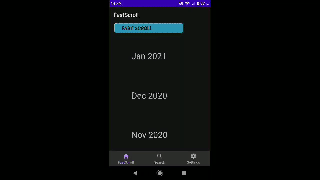

# SearchViewBottomNav

repo: https://github.com/jimandreas/SearchViewBottomNav

## Screen Animation

Demonstrates what this app has implemented:

&nbsp;&nbsp;

## Implemented:

* Search Fruits - remember search choices.  Show matches.

* Fast scroll of 20 years of monthly selections.  Based on the Google Photos fast scroll UX.

## UX credits

* Google Photos fast scroll.   It is really a good example of a useful scroll feature.

* Wikipedia search function.   It was the model to match for a search user experience.

Note that both of these UX features were implemented here as concepts for inclusion in the
Molecule Of The Month browser implementation.

Code credits:

* Android Studio Bottom Navigation Bar [template]

It is coded in Kotlin and is based on the `BottomNavigationBar` "Hello World" template
as kindly provided in Android Studio 4.1.

* [wikipedia app in github]

The UI in the Wikipedia app switches dynamically between a history of
the search function, and a dynamically updated match list based on the 
search entry text.  The design follows what exists in the Wikipedia app 
as of October 2020.

* [cheesesquare]

The design uses the collapsing toolbar view for the fruit activity.  The link above
references the github repo authored by @chrisbanes.

* [Reply material components android example]

The **Reply** sample application has a mostly non-functional search function - 
but the UI is based on the EditText widget rather than the SearchView
widget.   The EditText widget provides a sufficient level of 
base functionality and proved to be much simpler to manage 
in laying out UI components.   This sample app wires up the "cancel text" X
pushbutton, and the back arrow to dismiss the soft keyboard in a layout similar to
the **Reply** app.

* Images from [imgur]

The fruit images are all sourced from [imgur].   See the [FRUITS.md] file 
for the fruit images referenced and
their URLs.

[wikipedia app in github]: https://github.com/wikimedia/apps-android-wikipedia
[bottom navigation]: https://material.io/components/bottom-navigation
[template]: https://developer.android.com/studio/projects/templates#BottomNavActivity
[cheesesquare]: https://github.com/chrisbanes/cheesesquare
[Reply material components android example]: https://github.com/material-components/material-components-android-examples
[imgur]: https://imgur.com/
[Fruits.md]: https://github.com/jimandreas/SearchViewBottomNav/blob/master/FRUITS.md

